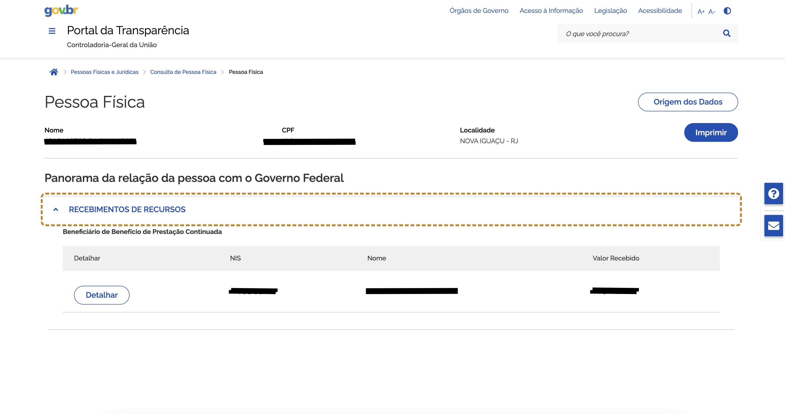

# API para automação e extração de dados do Portal da Transparência

Este bot visa coletar informação do site portal da transparência tendo como dado inicial o nome, CPF ou NIS da pessoa. 



Ao fazer a requisição POST, você obtem uma resposta em JSON com o seguinte formato:

```json
{
    "data": {
        "beneficios": "R$ 1.200,00",
        "cpf": "***.000.000-**",
        "data_consulta": "2023-10-01_12:00:00",
        "detalhes": [],
        "localidade": "Curitiba PR",
        "nome_completo": "João da Silva",
        "screenshot": {
            "base64_image": "iVBORw0KGgoAAA",
            "filename": "Joao da Silva_recebimento_recursos_20250421_003506.png"
        }
    },
    "status": "success"
}
```

> Dados ficticios!

## Estrutura do Projeto

```bash
api/
├── __init__.py
├── routes/
│   └── automation.py
├── services/
│   └── automation_service.py
├── schemas/
│   └── response_schema.py
└── docs/
    └── swagger_config.py
app.py
```

Documentação API: https://api-bot-portal.onrender.com/apidocs/

URL Requisição POST: https://api-bot-portal.onrender.com/api/automation/start
```json
{
  "input_value": "João da Silva"
}
```

---

## Instalação

### Utilizando Docker (recomendado)
Para utilizar é necessário que você tenha o Docker instalado e configurado, tendo isso basta rodar o comando abaixo e acessar a URL `http://localhost:8080/apidocs/` para ter acesso a automação.

```bash
docker compose up --build
```

---

### Sem o Docker (Linux/Mac)

1. Crie o `venv`:

```bash
python -m venv venv
```

2. Ativar o `venv`:

```bash
source venv/bin/activate
```

3. Instalar as bibliotecas:

```bash
pip install --upgrade pip
pip install -r requirements.txt
```

4. Rodando a API:

```bash
python api/app.py
```

---

### Sem Docker (Windows)


1. Crie o `venv`:

```bash
python -m venv venv
```

2. Ativar o `venv`:

```bash
venv\Scripts\activate
```

3. Instalar as bibliotecas:

```bash
pip install --upgrade pip
pip install -r requirements.txt
```

4. Rodando a API:

```bash
python api\app.py
```

---

# Desafios enfrentados

1 - O xPath do Termo estava excedendo o timeout por não estar visível devido a um erro de permissao 403.
> A solução foi adicionar `user_agent`.

2 - Problemas com o checkbox.
> Foi solucionado forçando a marcação do item com javascript.

3 - Devido ao site identificar que era uma automação o mesmo começou a apresentar uma verificação via captcha.
> Solucao criar uma funcao que resolve o mesmo utilizando uma API de terceiro no entando como é paga deixei desabilitada.
